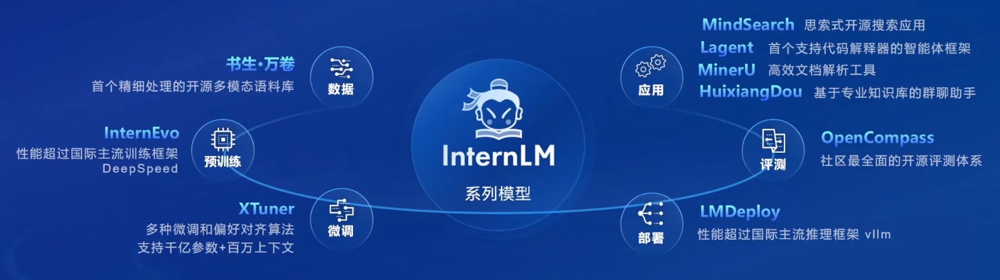
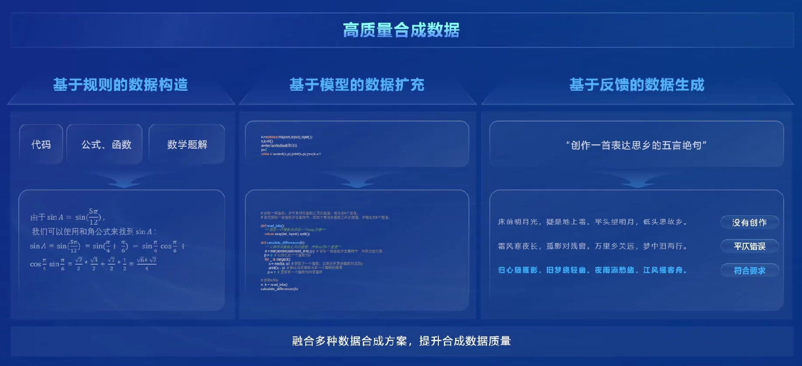
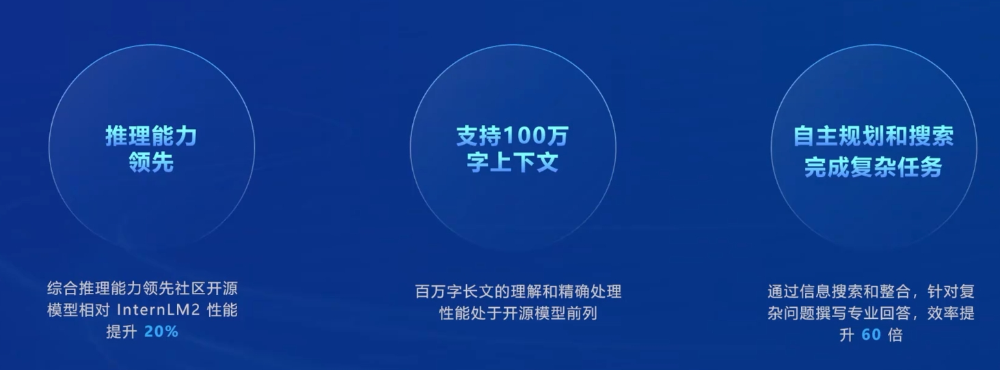
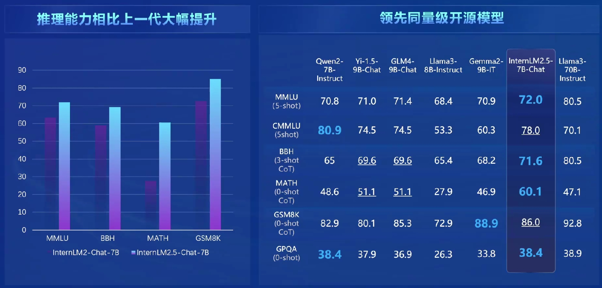
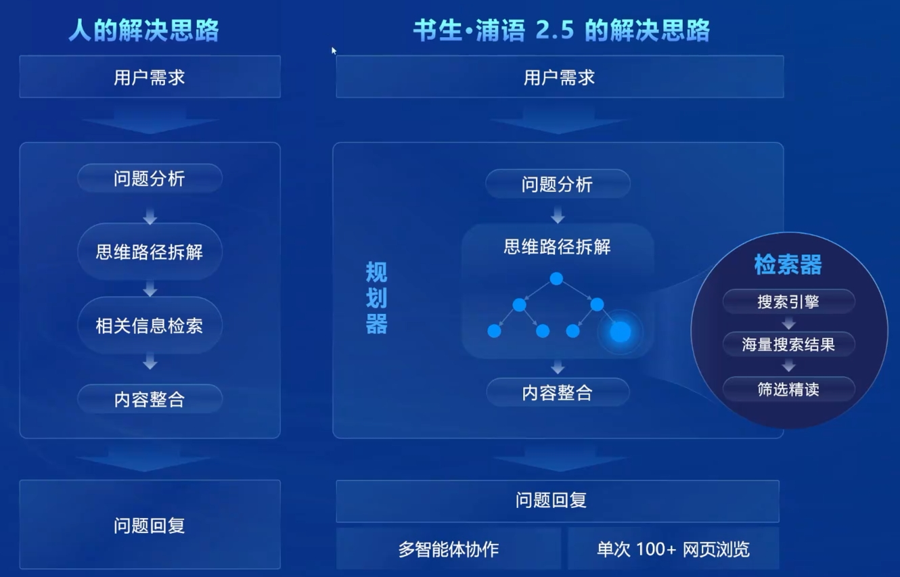
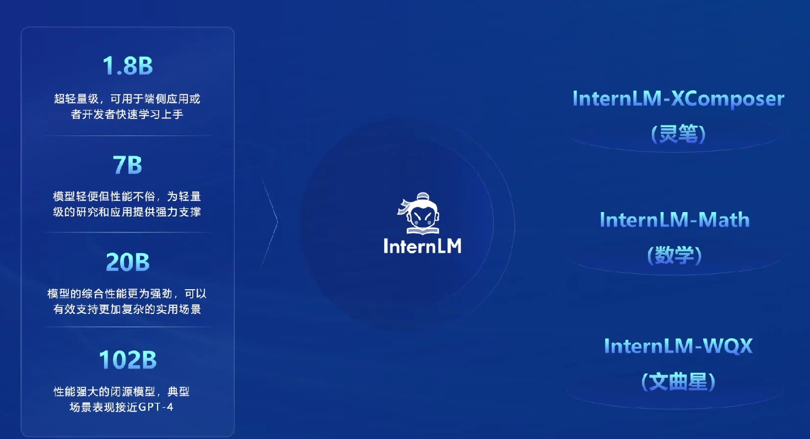
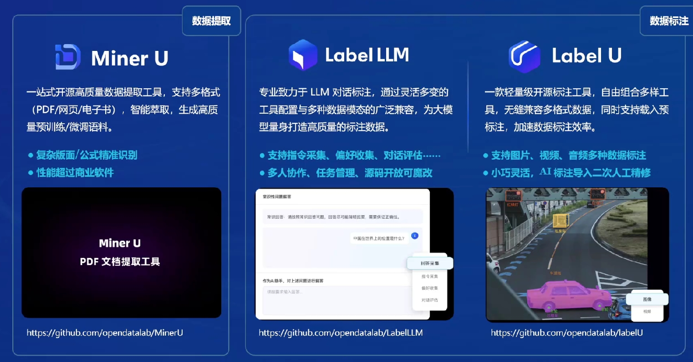
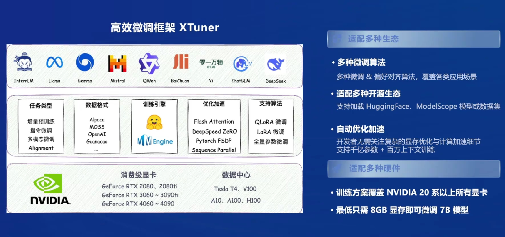
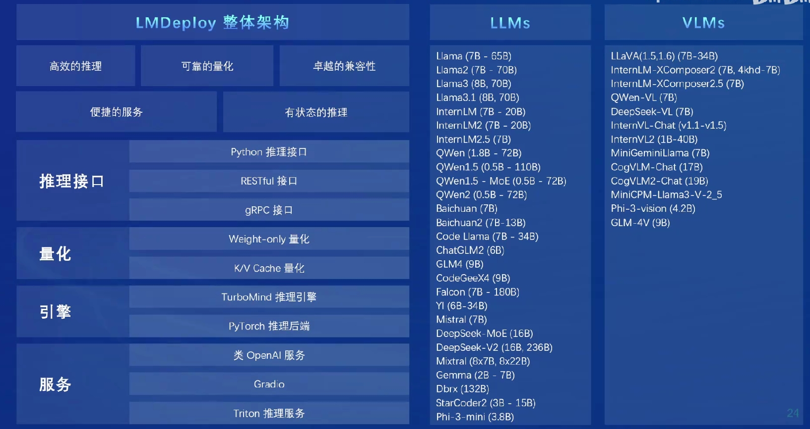

## 书生大模型全链路开源体系

  

## 高质量的训练数据
融合了基于规则的数据构造、基于模型的数据扩充、基于反馈的数据生成三种方案，有效的提升了合成数据质量。

  

## 领先业界的超长上下文推理能力

  

  

## 强大的检索规划分析能力

  

## 不同模型侧重点及应用方式

  

## 开源数据标注生态

  

## 微调架构

  

## 强大的落地部署工具

  

